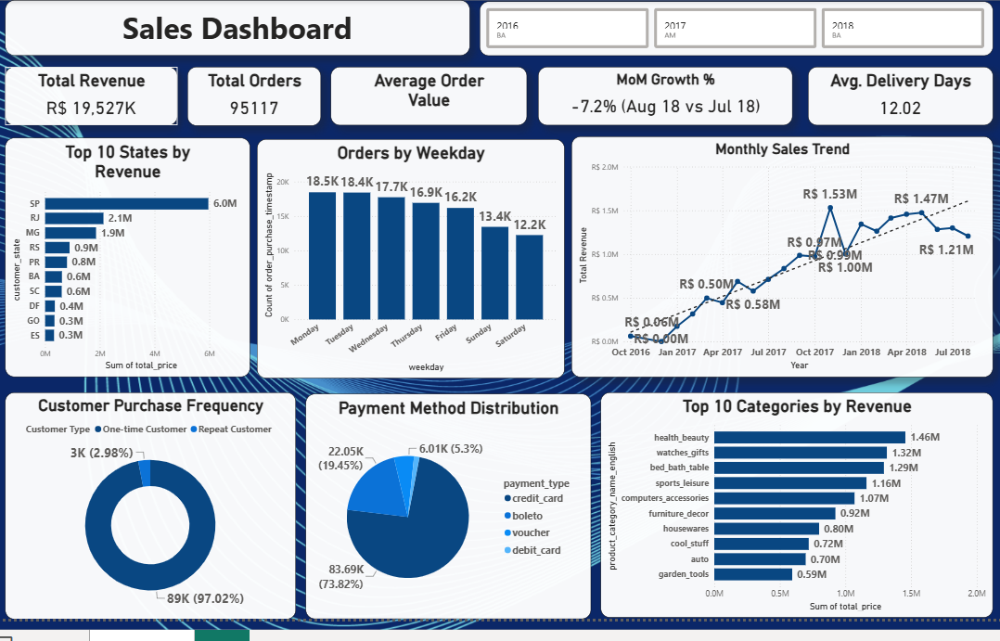

# Brazilian E-Commerce Sales Analysis

An end-to-end data analytics project analyzing Brazilian e-commerce sales using Python, SQL, and Power BI. The project focuses on sales performance, customer purchasing behavior, product categories, payment methods, geographic performance, and delivery operations.

---

## 📌 Project Overview

This project analyzes the Brazilian E-Commerce Public Dataset by Olist to uncover meaningful business insights from e-commerce transactions.

The analysis follows a complete data analytics workflow:

**Raw Data → Data Cleaning → Data Transformation → Python EDA → SQL Analysis → Power BI → DAX → Dashboard → Business Insights**

The goal is to demonstrate practical skills in data cleaning, exploratory data analysis, SQL querying, business intelligence, data visualization, KPI development, and business-oriented insight generation.

---

## 🎯 Business Objectives

The main objectives of this project are to:

- Analyze overall e-commerce sales performance
- Identify top-performing product categories
- Analyze revenue by customer state
- Understand customer purchase frequency
- Analyze payment method preferences
- Identify sales patterns by weekday and month
- Evaluate seller performance
- Measure average delivery time
- Monitor month-over-month revenue performance
- Build an interactive Power BI dashboard
- Generate actionable business recommendations

---

## 📊 Dataset

The project uses the **Brazilian E-Commerce Public Dataset by Olist**, containing information about orders, customers, products, sellers, payments, reviews, and delivery.

The original dataset contains multiple related CSV files, including:

- Customers
- Orders
- Order Items
- Order Payments
- Order Reviews
- Products
- Sellers
- Product Category Translation
- Geolocation

For this analysis, the relevant datasets were combined into an analytical dataset. The geolocation dataset was not included in the final merged dataset because it was not required for the primary business analysis.

### Final Analytical Dataset

After filtering for delivered orders and completing data cleaning:

- **113,375** order-item records
- **95,117** unique orders
- **92,069** unique customers
- **31,618** unique products
- **2,912** unique sellers
- **71** product categories
- **27** customer states
- **22** seller states
- **4** payment methods

---

## 🧹 Data Cleaning & Preparation

The data preparation process included:

- Combining multiple Olist datasets
- Inspecting data types and missing values
- Filtering the analysis to delivered orders
- Handling missing delivery-related values
- Handling missing product attributes
- Converting timestamp columns to datetime format
- Creating delivery duration metrics
- Creating revenue-related calculations
- Creating time-based features

### Derived Columns

The following analytical columns were created:

- `delivery_days`
- `total_price`
- `year`
- `month`
- `day`
- `weekday`
- `month_year`

The final cleaned dataset contains no remaining missing values in the analytical dataset.

---

## 🐍 Python Exploratory Data Analysis

Python was used for data cleaning, transformation, exploratory analysis, and visualization.

### Main Python Analysis

The analysis included:

1. Monthly Sales Trend
2. Top Product Categories
3. Sales by Customer State
4. Payment Method Distribution
5. Delivery Time Distribution
6. Top Sellers
7. Orders by Weekday
8. Customer Purchase Frequency

### Python Libraries

- Python
- Pandas
- NumPy
- Matplotlib
- Seaborn
- Jupyter Notebook

---

## 🗄️ SQL Analysis

SQL was used to answer key business questions and validate analytical results.

The SQL analysis focuses on:

- Total revenue
- Total orders
- Average Order Value
- Monthly revenue trends
- Top product categories
- Top customer states
- Top sellers
- Payment method distribution
- Customer purchase frequency
- Delivery performance
- Ranking and comparative analysis

SQL helped demonstrate the ability to transform business questions into structured queries and extract actionable information from data.

---

## 📊 Power BI Dashboard

The final Power BI dashboard provides an interactive overview of sales performance and customer behavior.

### Dashboard Features

- Year filter
- Total Revenue KPI
- Total Orders KPI
- Average Order Value KPI
- Month-over-Month Growth KPI
- Average Delivery Days KPI
- Top 10 States by Revenue
- Orders by Weekday
- Monthly Sales Trend
- Customer Purchase Frequency
- Payment Method Distribution
- Top 10 Categories by Revenue

### Dashboard Preview

!## 📊 Power BI Dashboard



---

## 📈 Key KPIs

| KPI | Result |
|---|---:|
| Total Revenue | **R$19.53M** |
| Total Orders | **95,117** |
| Average Order Value | **R$205.30** |
| Unique Customers | **92,069** |
| Unique Products | **31,618** |
| Unique Sellers | **2,912** |
| Average Delivery Time | **12.02 days** |
| Product Categories | **71** |

---

## 💡 Key Insights

### 1. São Paulo is the dominant revenue market

São Paulo generated approximately **R$6.0M** in revenue, significantly higher than other states.

The next major markets include:

- Rio de Janeiro — approximately R$2.1M
- Minas Gerais — approximately R$1.9M
- Rio Grande do Sul — approximately R$0.9M
- Paraná — approximately R$0.8M

This indicates a strong concentration of revenue in Brazil's major consumer markets.

---

### 2. Health & Beauty is the leading product category

The highest-revenue product categories include:

| Rank | Category | Approx. Revenue |
|---|---|---:|
| 1 | Health & Beauty | R$1.46M |
| 2 | Watches & Gifts | R$1.32M |
| 3 | Bed, Bath & Table | R$1.29M |
| 4 | Sports & Leisure | R$1.16M |
| 5 | Computers & Accessories | R$1.07M |
| 6 | Furniture & Decor | R$0.92M |
| 7 | Housewares | R$0.80M |
| 8 | Cool Stuff | R$0.72M |
| 9 | Auto | R$0.70M |
| 10 | Garden Tools | R$0.59M |

Health & Beauty leads the top categories with approximately **R$1.46M** in revenue.

---

### 3. Credit cards dominate payment methods

Credit card payments represent approximately **73.82%** of the payment distribution.

Other payment methods include:

- Boleto — approximately 19.45%
- Voucher — approximately 5.3%
- Debit card — remaining share

This indicates that credit cards are the dominant payment method among customers in the analyzed dataset.

---

### 4. Monday has the highest number of orders

Orders are distributed across the week, with the highest volumes occurring during the early part of the week.

Approximate order counts:

- Monday — 18.5K
- Tuesday — 18.4K
- Wednesday — 17.7K
- Thursday — 16.9K
- Friday — 16.2K
- Sunday — 13.4K
- Saturday — 12.2K

Monday has the highest order volume, while Saturday has the lowest.

---

### 5. Customer repeat purchasing is relatively low

The customer purchase frequency analysis shows that the large majority of customers are one-time purchasers.

Approximately:

- **97.02%** — One-time customers
- **2.98%** — Repeat customers

This indicates a potential customer retention opportunity.

Businesses could investigate:

- Customer loyalty programs
- Personalized promotions
- Post-purchase communication
- Product recommendations
- Repeat-purchase incentives

---

### 6. Average delivery time is approximately 12 days

The average delivery time for delivered orders is approximately:

**12.02 days**

Delivery performance can be further investigated by:

- Customer state
- Seller state
- Product category
- Seller
- Month
- Geographic region

---

### 7. Revenue grew strongly during the earlier period

The monthly sales trend shows substantial growth during 2017, with revenue reaching approximately **R$1.53M** at its highest point in the analyzed period.

Revenue remained relatively strong during 2018, although the later period shows some decline.

This suggests that sales performance changed considerably over time and should be monitored using monthly and year-over-year metrics.

---

## 📌 Business Recommendations

Based on the analysis, the following recommendations can be considered:

### 1. Focus on high-performing markets

São Paulo and other high-revenue states should receive greater attention in:

- Marketing campaigns
- Inventory planning
- Seller acquisition
- Delivery optimization

### 2. Prioritize high-performing categories

Categories such as Health & Beauty, Watches & Gifts, Bed & Bath, and Sports & Leisure should be monitored closely for:

- Inventory availability
- Pricing
- Promotions
- Product assortment

### 3. Improve customer retention

The high percentage of one-time customers suggests an opportunity to increase repeat purchases through:

- Loyalty programs
- Personalized offers
- Email campaigns
- Cross-selling
- Product recommendations
- Post-purchase engagement

### 4. Monitor payment behavior

Since credit cards account for the majority of payments, businesses can optimize the checkout experience around the most commonly used payment methods while continuing to support alternative options.

### 5. Improve delivery performance

With an average delivery time of approximately 12 days, delivery performance can be analyzed further by state, seller, and product category to identify areas for operational improvement.

### 6. Monitor monthly sales performance

Monthly revenue and MoM growth should be tracked regularly to identify:

- Growth periods
- Seasonal patterns
- Revenue declines
- Opportunities for promotional campaigns

---

## 🛠️ Tools & Technologies

### Programming & Analysis
- Python
- Pandas
- NumPy
- Matplotlib
- Seaborn
- Jupyter Notebook

### Database & Querying
- SQL
- MySQL

### Business Intelligence
- Microsoft Power BI
- DAX

### Data Visualization
- Power BI
- Matplotlib
- Seaborn

---

## 📁 Project Structure

```text
brazilian-ecommerce-sales-analysis/
│
├── README.md
├── LICENSE
├── .gitignore
│
├── notebooks/
│   └── brazilian_ecommerce_analysis.ipynb
│
├── sql/
│   └── ecommerce_analysis.sql
│
├── powerbi/
│   └── brazilian_ecommerce_dashboard.pbix
│
├── images/
│   ├── olist_dashboard.png
│   ├── sales_analysis.png
│   └── customer_analysis.png
│
└── data/
    └── README.md

The large raw Olist dataset is intentionally excluded from the repository because of GitHub file-size limitations.
